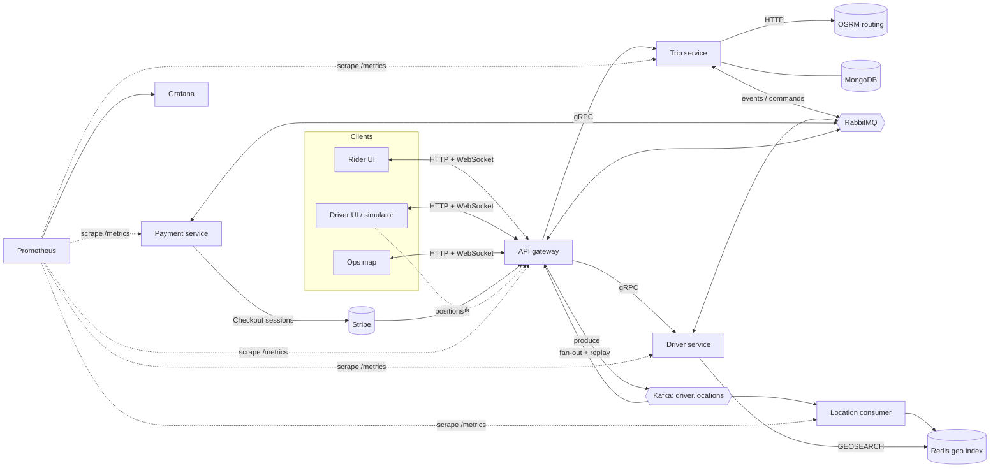
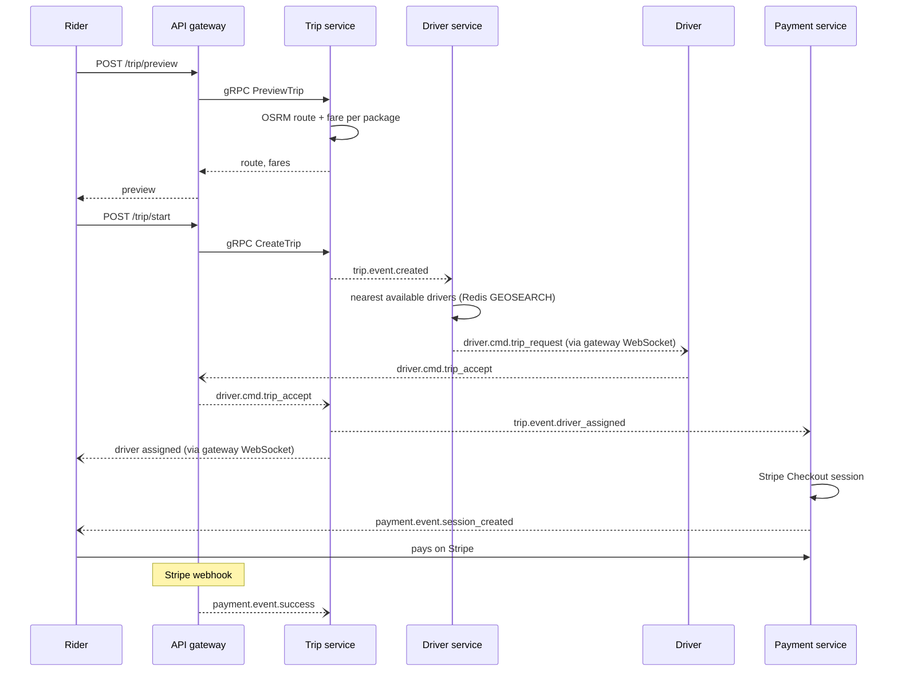

# Flagdown

[](https://github.com/vramaswamy4/flagdown/actions/workflows/ci.yml)

A full-stack ride-sharing app: Go microservices on Kubernetes behind a Next.js web app for riders, drivers and operations. Riders preview a route and request a trip, the system finds the nearest available driver, the driver accepts over a WebSocket, and the rider pays through Stripe. Services talk gRPC when they need an answer and RabbitMQ when they don't. Driver positions flow through a separate real-time pipeline (Kafka → Redis geo index) that feeds both matching and a live operations map.

Around that core: Prometheus metrics and a Grafana dashboard on every service, distributed tracing across the async hops, a chaos test that kills a pod mid-ride and proves the ride still completes, and CI on every push.

**Contents:** [Architecture](#architecture) · [Services](#services) · [How a ride works](#how-a-ride-works) · [Driver-location pipeline](#driver-location-pipeline) · [Live map](#live-map) · [Observability](#observability) · [Chaos test](#chaos-test) · [Stack, and why](#stack-and-why) · [Decisions](#decisions) · [Running locally](#running-locally) · [Repo layout](#repo-layout) · [What I learned](#what-i-learned) · [Attribution](#attribution)

## Architecture



Two communication styles, used on purpose:

- **gRPC, synchronous** — when the caller needs the answer to continue. The gateway calls `PreviewTrip` and `CreateTrip` and returns the result to the browser. Contracts live in [`proto/`](proto/) and the generated code is shared by both sides, so a breaking change fails at compile time, not at runtime.
- **RabbitMQ, asynchronous** — when the caller only needs to announce that something happened. `trip.event.created` doesn't care who is listening; today it's the driver service (find a driver) and the gateway (tell the rider's socket). Adding a consumer never touches the publisher.

And a third path for a different shape of data: **Kafka** carries driver positions, a high-volume stream that several consumers read independently and that needs to be replayable. See [Decisions](#decisions) for why that isn't also RabbitMQ.

## Services

| Service | Talks to | Responsibility |
|---|---|---|
| **api-gateway** | trip, driver (gRPC) · RabbitMQ · Kafka · browsers (HTTP + WebSocket) | The only public entry point. Translates HTTP to gRPC, holds rider and driver WebSocket connections, pushes queue events to the right socket, receives Stripe webhooks, produces driver positions to Kafka and fans them out to map clients. |
| **trip-service** | OSRM (HTTP) · MongoDB · RabbitMQ | Trip lifecycle: route preview, fare estimation per ride package, trip creation, driver assignment, completion after payment. |
| **driver-service** | Redis · RabbitMQ | Driver registration and availability. Consumes `trip.event.created`, finds the nearest available drivers, and offers the trip to them one at a time. |
| **payment-service** | Stripe · RabbitMQ | Creates a Stripe Checkout session when a driver is assigned; publishes payment events. |
| **location-consumer** | Kafka · Redis | Reads `driver.locations` and maintains the Redis geo index the driver service matches against. |
| **web** | gateway | Next.js rider and driver UI, plus the ops map. |

Each Go service follows the same layered layout ([trip-service README](services/trip-service/README.md)): `domain` holds the models and the interfaces, `service` holds business logic written against those interfaces, and `infrastructure` holds the things that touch the outside world (gRPC handlers, the Mongo repository, the RabbitMQ publisher and consumers). The trip service ran on an in-memory repository until persistence arrived; swapping in MongoDB changed one constructor call in `main.go`, which is the point of the layout.

## How a ride works



Solid arrows are request/response; open arrows are messages on the broker. If a driver declines or doesn't answer, the driver service offers the trip to the next-nearest driver, and publishes `trip.event.no_drivers_found` when the list runs out.

**Messaging details that matter:**

- One topic exchange for trips, routing keys named `<service>.<event|cmd>.<name>` ([`shared/contracts/amqp.go`](shared/contracts/amqp.go)). Events say what happened; commands ask one recipient to do something. The naming makes it obvious which is which when reading a consumer.
- Queues are durable, messages are persistent, and consumers ack manually *after* the work succeeds. A service that dies mid-message gets the message again when it comes back.
- Failed handlers retry with exponential backoff ([`shared/retry`](shared/retry/retry.go)); messages that keep failing go to a dead-letter queue instead of looping forever.
- Every message carries an owner ID, so the gateway knows which WebSocket connection to push it to without the publishing service knowing sockets exist.

The full exchange/queue map is in [docs/architecture](docs/architecture/).

## Driver-location pipeline

Driver positions are the highest-volume data in the system, and three things need them at once: matching, the live map, and trip replay. They travel on their own path, and the driver service holds no fleet state in memory, so any replica can match and a restart loses nothing.

```
driver app ──WebSocket──▶ gateway ──produce──▶ Kafka topic: driver.locations (key = driver ID)
                                                   │
                        ┌──────────────────────────┼────────────────────────┐
                        ▼                          ▼                        ▼
               location-consumer           gateway fan-out            replay reader
               (consumer group)         (map clients, live)     (seek by timestamp)
                        │
                        ▼
              Redis: GEOADD drivers:available
                        ▲
                        │ GEOSEARCH … BYRADIUS … ASC COUNT n
                  driver-service
```

- **Keyed by driver ID**, so all of one driver's positions land on one partition and stay in order. Ordering across drivers doesn't matter.
- **The consumer is idempotent.** `GEOADD` overwrites a driver's previous position, so at-least-once delivery and replays after a crash are harmless. That let me skip exactly-once machinery entirely.
- **Stale drivers expire.** Redis geo sets have no per-member TTL, so the consumer also writes each driver's last-seen time to a sorted set, and a sweeper removes drivers who have stopped reporting from both. Without this, a driver who closed the app would stay matchable forever.
- **Matching is one Redis call**: nearest available drivers within a radius, sorted by distance, filtered by ride package. Any replica of the driver service can answer it, because the state is no longer inside the process.
- **A driver simulator** drives the whole thing in development: it replays a fleet of drivers along real OSRM routes, so the map and the matcher have realistic movement without anyone holding a phone.

## Live map

An operations view at `/ops` in the web app, built with MapLibre GL and deck.gl:

- **Moving drivers** — positions streamed from the gateway's Kafka fan-out over WebSocket.
- **Demand heatmap** — trip requests bucketed into H3 hexagons. Hexagons have uniform neighbour distance, which square geohash cells don't, so density reads correctly in every direction.
- **Trip replay** — a scrubber that re-reads a trip's positions from Kafka by timestamp. This is the feature that justifies keeping locations in a log: the history is already there, nothing extra is stored for it.
- **Ops panel** — consumer lag, matches per minute and match latency, read from Prometheus.

The rider and driver screens use Leaflet, which is plenty for one route and a handful of markers. The ops map uses MapLibre GL with deck.gl because it draws a whole fleet and a hexagon layer on the GPU.

## Observability

- **Metrics:** every service exposes `/metrics`. Beyond the Go runtime defaults I record request rate, error rate and duration per gRPC method and HTTP route, messages published/consumed/dead-lettered per routing key, match latency (trip created → driver offered) as a histogram, and Kafka consumer lag for the location consumer.
- **Dashboard:** one Grafana dashboard, provisioned from a JSON file in the repo so it comes up with the cluster: traffic and errors per service, match latency percentiles, consumer lag, queue depth.
- **Tracing:** OpenTelemetry spans exported to Jaeger. Trace context travels through gRPC metadata *and* through RabbitMQ message headers, so one trace follows a ride from the rider's HTTP request through the async hops to the payment event. Without the header propagation, every trace would stop at the first queue.

## Chaos test

The claim "the system recovers" is cheap, so there is a test for it. With a ride in flight — trip created, driver not yet assigned — the script deletes the trip-service pod and then asserts that:

1. Kubernetes restarts the pod,
2. the unacked `driver.cmd.trip_accept` message is redelivered once the service is back,
3. the trip reaches `driver_assigned` and the rider's socket gets the update,
4. nothing was processed twice.

It passes because of choices made earlier, not because of anything in the test: trip state lives in MongoDB rather than in process memory, queues are durable with manual acks, startup connections retry with backoff, and handlers are idempotent on trip ID. The same run shows up on the Grafana dashboard as a gap in trip-service traffic and a short spike in queue depth that drains on recovery.

## Stack, and why

| | Used for | Why this one |
|---|---|---|
| **Go** | All backend services | Small static binaries and cheap concurrency: one goroutine per WebSocket connection and per consumer is the natural way to write it. It was also new to me, which was part of the point. |
| **gRPC + Protocol Buffers** | Service-to-service calls | Typed contracts shared by client and server, generated from one `.proto` file. |
| **RabbitMQ** | Events and commands | Routing is the feature: topic exchanges and per-consumer queues fit "this happened, whoever cares" and "you, do this". Per-message acks and dead-lettering come built in. |
| **Kafka** | Driver positions | A partitioned, replayable log with independent consumer groups. Three readers consume the same stream at their own pace, and replay is a seek, not a feature I had to build. |
| **Redis (geo)** | Nearest-driver index | `GEOSEARCH` answers "who is closest" in one call, and moving state out of the driver service makes it horizontally scalable. |
| **MongoDB** | Trips and fares | A trip is one document that grows as it moves through its lifecycle (route, fare, driver, payment); no joins are needed to read it. |
| **WebSockets** | Gateway ↔ browsers | Trip offers, assignment updates and map positions are server-initiated; polling would be slower and heavier. |
| **Stripe Checkout** | Payments | Hosted payment page, so card data never touches my services. A webhook is the source of truth for success, not the browser redirect. |
| **OSRM** | Routing | Real road routes and durations without an API key. |
| **Kubernetes + Tilt** | Running it all | Every service is a Deployment with its own config and probes. Tilt rebuilds and live-syncs a service's binary into its pod on save, so the local loop is seconds even with everything running in a cluster. |
| **Prometheus, Grafana, OpenTelemetry, Jaeger** | Metrics and tracing | Pull-based metrics suit short-lived pods; traces answer "where did this ride spend its time" across async hops. |
| **GitHub Actions** | CI | `go vet` and race-enabled tests on every push. |
| **Next.js, React, Tailwind, Leaflet, MapLibre GL, deck.gl, H3** | Web UI and ops map | Leaflet for the rider and driver screens; MapLibre + deck.gl for GPU-rendered fleet and H3 hexagon layers on the ops map. |

## Decisions

The choices that shaped the system, with what each was chosen over:

- **Two brokers, not one.** Commands and events are low-volume, routed work items where each message should be handled once and then disappear. Locations are a high-volume stream that several consumers read independently and re-read later. RabbitMQ is good at the first and Kafka at the second; forcing either to do both means rebuilding the other's features by hand. The cost is operating two brokers, which I accepted.
- **Redis as the matching index, not the driver service's memory.** In-process state made the driver service a singleton and wiped the fleet on every restart.
- **At-least-once everywhere, idempotent handlers.** I never tried for exactly-once. Position writes overwrite, trip transitions check current state before applying, and the chaos test asserts no double-processing.
- **Pin minikube to the Docker runtime.** Tilt builds images straight into the cluster's Docker daemon; minikube's newer containerd default has no such daemon and the failure looks like a registry credentials error. That one cost an afternoon.

## Running locally

Prerequisites: Go 1.23+, Docker, kubectl, minikube, Tilt, and `protoc` with the Go plugins if you want to regenerate the gRPC code.

```bash
minikube start --driver=docker --container-runtime=docker
tilt up
```

Tilt compiles each service, builds its image, applies the manifests in [`infra/development/k8s`](infra/development/k8s/), and port-forwards the web UI to [localhost:3000](http://localhost:3000) and the gateway to `localhost:8081`. Editing a Go file recompiles that service and syncs the new binary into its running pod.

Payments need Stripe test keys in a `secrets.yaml` (see the commented line at the top of the [Tiltfile](Tiltfile)); everything else runs without credentials.

```bash
make generate-proto   # after editing anything in proto/
```

## Repo layout

```
proto/                  gRPC contracts
services/
  api-gateway/          HTTP + WebSocket edge, gRPC clients, Stripe webhook, Kafka producer
  trip-service/         cmd/, internal/{domain,service,infrastructure}, pkg/types
  driver-service/
  payment-service/
  location-consumer/
shared/                 generated proto code, contracts (routing keys, WS and HTTP shapes),
                        env, retry, messaging and tracing helpers
infra/
  development/          Dockerfiles + manifests used by Tilt
  production/           multi-stage Dockerfiles + manifests for a real cluster
web/                    Next.js app: rider UI, driver UI, /ops map
docs/                   architecture diagrams
tools/                  service scaffolding
```

## What I learned

I came to this from Python and JavaScript, with a production Flask/React/PostgreSQL product ([JustBook](https://justbookapp.com)) behind me — a monolith, deliberately. This project was about the things a monolith never makes you face.

- **Go changes how you write failure.** Errors are values you handle at every call, not exceptions that bubble. It felt verbose for a week, and then I noticed I could read any function and see every way it fails. Implicit interfaces were the other shift: the trip service defines the repository interface *it* needs, and the Mongo and in-memory implementations satisfy it without declaring anything.
- **`context` is the spine of a Go service.** Deadlines and cancellation flow from the HTTP request through gRPC into the database call. In Python I'd never had one object that did that.
- **The hard part of microservices is the space between them.** Each service is small and easy. Deciding what is a synchronous call and what is an event, what happens when a consumer dies mid-message, and how to follow one ride across four processes — that's where the time went, and it's where the design is.
- **Delivery guarantees are a design input.** Once I accepted at-least-once delivery, idempotent handlers stopped being a nicety and became the requirement everything else leans on. The chaos test is really a test of that one property.
- **Pick the data structure, then the database.** "Nearest driver" is a geo query, "what happened on this trip" is a log replay, "the trip" is a document. Each store is there because of the shape of one question.
- **Local Kubernetes is a skill of its own.** The minikube runtime problem taught me more about how images actually reach a cluster than any tutorial did, because nothing in the error message pointed at the cause.
- **Writing decisions down as I made them** was the cheapest useful habit. I kept a log with one entry per non-obvious choice: what, why, over what, and what would change my mind. Several entries were wrong the first time I wrote them, and having to fill in the last field is how I found out.

What I'd do differently: define the metrics before writing the service instead of after, and introduce the persistent store earlier — the in-memory repository hid a class of restart bugs until late.

## Attribution

The project scaffold — the Next.js rider/driver UI, the Tiltfile skeleton, and parts of `shared/` — comes from [codealong-dev/microservices-go-starter](https://github.com/codealong-dev/microservices-go-starter), the starter for Tiago Taquelim's course *Complete Microservices with Go*. I copied it in rather than forking, and wrote the services by following the course in my own repo. The gateway, trip, driver and payment services follow the course's design; the location pipeline, Redis matching, metrics and dashboard, chaos test, CI and ops map are my own.
## Author

Vinith Ramaswamy · [LinkedIn](https://www.linkedin.com/in/vinith-ramaswamy-6a5964200) · [justbookapp.com](https://justbookapp.com)
